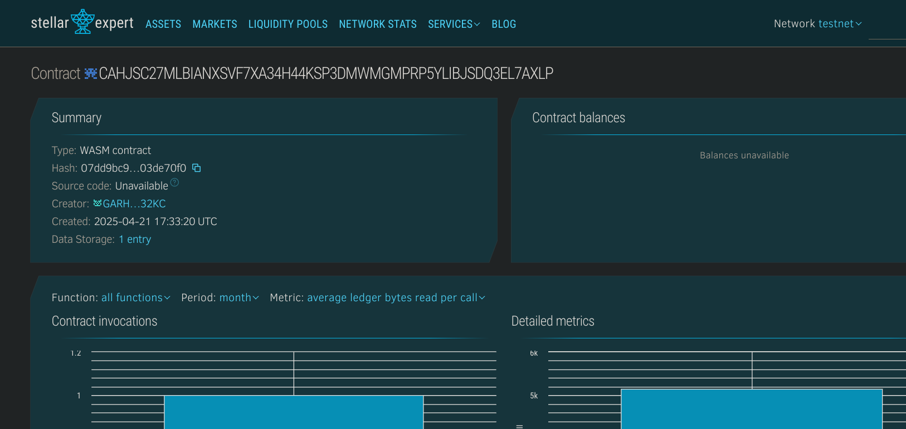

   # Smart Contract Deployment Dashboard

   ## Project Title
   Smart Contract Deployment Dashboard

   ## Project Description
   The Smart Contract Deployment Dashboard is a Soroban-based solution designed to simplify the tracking and management of smart contracts deployed on the Stellar blockchain. It provides a centralized registry for deployed contracts, allowing developers and organizations to monitor their contract deployments, track versions, and manage contract lifecycle states.

   This dashboard serves as a contract registry that stores essential information about each deployed contract, including contract address, name, description, owner, deployment timestamp, status, and version. It enables users to register new contracts, update their statuses, and retrieve contract information.

   ## Project Vision
   The vision for the Smart Contract Deployment Dashboard is to create a comprehensive solution that enhances transparency, governance, and management of smart contracts on the Stellar blockchain. By providing a central registry and management interface, the dashboard aims to simplify contract deployment workflows, improve contract discoverability, and enable better lifecycle management.

   Our goal is to address the challenges faced by development teams and organizations when dealing with multiple contract deployments across different environments, ensuring better visibility, traceability, and governance of smart contracts.

   ## Key Features

   1. **Contract Registration**: 
      - Register deployed contracts with essential metadata
      - Automatically track deployment timestamps
      - Associate contracts with their owners

   2. **Status Management**:
      - Update contract statuses (Active, Inactive, Pending, Deprecated)
      - Track contract lifecycle states

   3. **Contract Information Retrieval**:
      - Retrieve detailed information about registered contracts
      - Access contract metadata and deployment details

   4. **Deployment Statistics**:
      - Track total number of contracts deployed
      - Monitor contract deployment patterns

   ## Future Scope

   1. **Enhanced Access Control**:
      - Implement role-based permissions for contract management
      - Allow contract owners to delegate management rights

   2. **Version Management**:
      - Track contract upgrade history
      - Compare different versions of the same contract
      - Implement semantic versioning support

   3. **Integration Capabilities**:
      - Connect with other blockchain explorers
      - API endpoints for external service integration
      - Webhooks for deployment notifications

   4. **Analytics Dashboard**:
      - Visualize contract deployment trends
      - Monitor gas usage and optimization opportunities
      - Track contract interactions and usage statistics

   5. **Automated Auditing**:
      - Integration with security scanning tools
      - Automated compliance checks
      - Risk assessment for deployed contracts

   6. **Multi-chain Support**:
      - Extend support to other compatible blockchains
      - Cross-chain contract management capabilities

   7. **Governance Features**:
      - Voting mechanisms for contract upgrades
      - Proposal system for contract modifications
      - Decentralized governance for critical contracts

   ## Contract Details:
   CAHJSC27MLBIANXSVF7XA34H44KSP3DMWMGMPRP5YLIBJSDQ3EL7AXLP
   